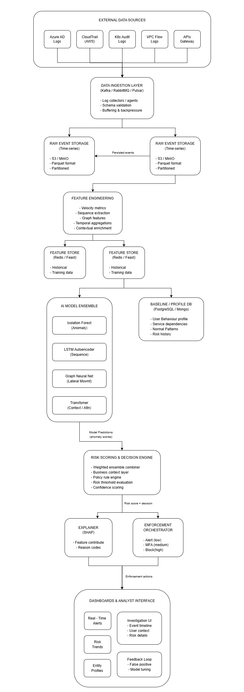
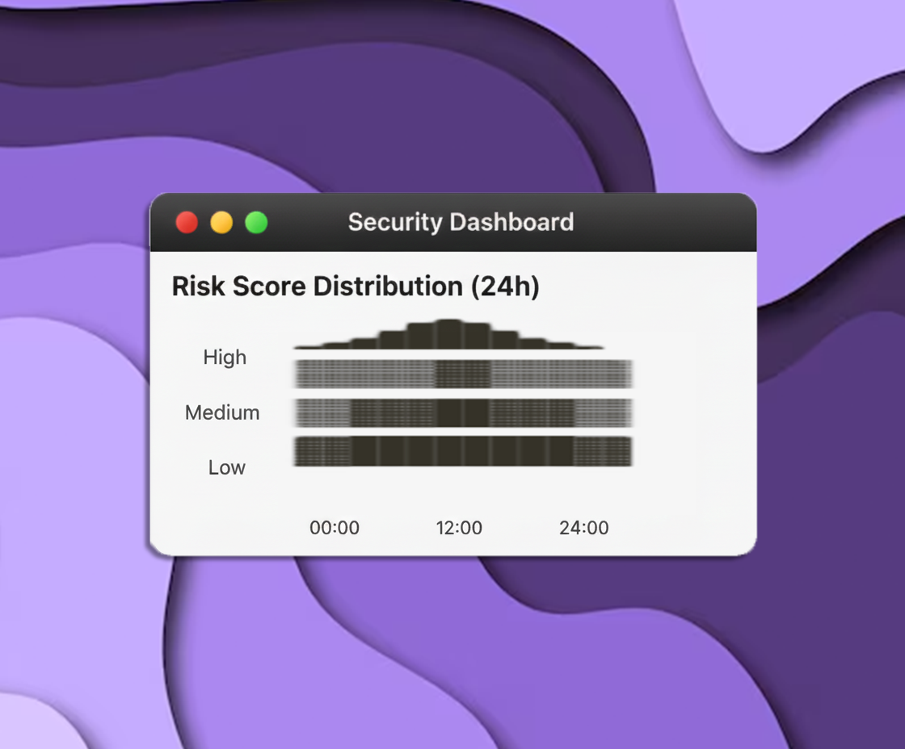
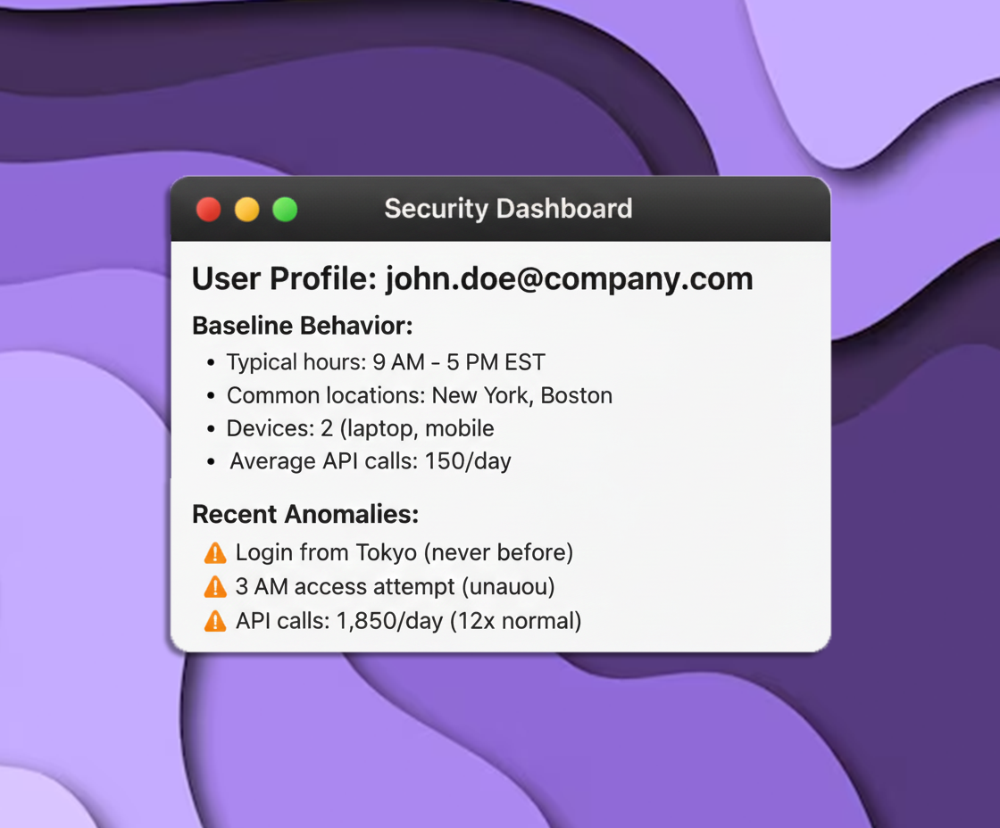
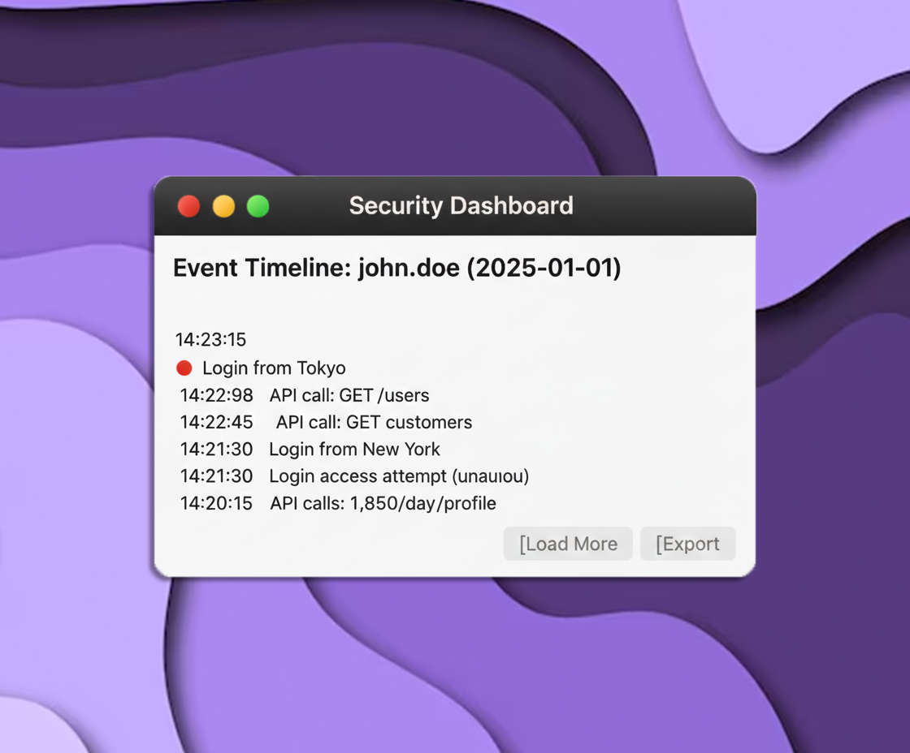
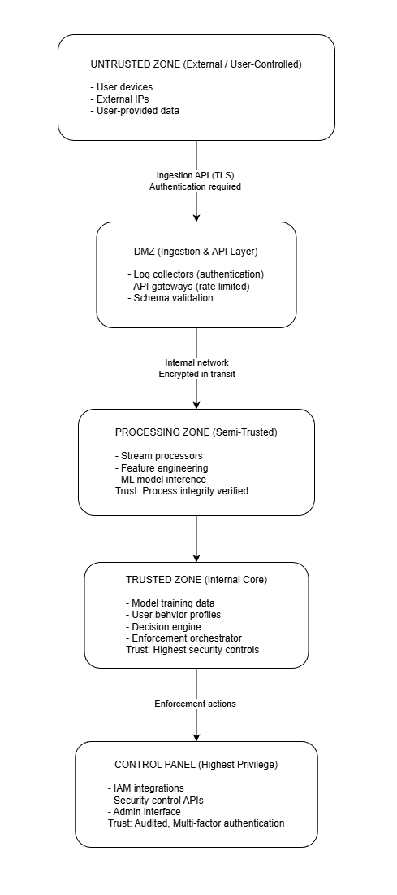
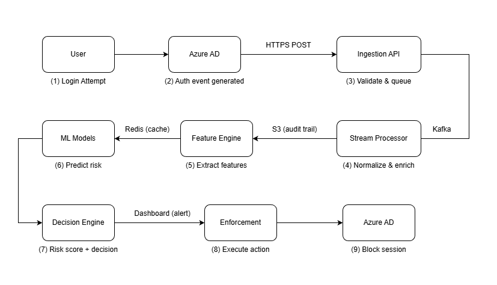

# System Architecture: AI-Driven Zero-Trust Behavior Firewall (ZTBF)

**Version**: 1.0  
**Date**: 2026-01-01  
**Status**: Phase 0 - Foundation  
**Target Environment**: Cloud-Native (AWS/Azure), Free Development MVP

---

## Architecture Principles

### Design Philosophy
1. **Zero Trust**: Never trust, always verify, assume breach
2. **Cloud-Native**: Containerized, horizontally scalable, infrastructure-as-code
3. **AI-First**: Machine learning at the core, not bolted-on
4. **Privacy-Aware**: Metadata-only analysis, no payload inspection
5. **Explainable**: Every decision traceable and auditable
6. **Free-First MVP**: Local development, no cloud costs during Phases 0-2

### Non-Functional Requirements
- **Latency**: Risk decision < 500ms (real-time blocking)
- **Throughput**: 10,000 events/second (design capacity)
- **Availability**: 99.9% uptime (3-nines)
- **Scalability**: Horizontal scaling for all components
- **Durability**: Event data retained 90 days (configurable)

---

## High-Level System Architecture



---

## Component Details

### 1. DATA INGESTION LAYER

**Purpose**: Reliably collect events from multiple sources

**Technologies (MVP)**:
- **Message Queue**: Apache Kafka (Redpanda for lightweight local dev)
- **Log Shippers**: Filebeat, Fluentd, custom collectors
- **API Gateway**: FastAPI endpoints for push-based ingestion

**Key Features**:
- Schema validation (Avro/JSON Schema)
- Buffering for burst traffic
- Backpressure handling
- Dead letter queue for malformed events

**Data Sources**:
```yaml
# Source 1: Azure AD Sign-in Logs
Format: JSON
Schema: Microsoft Graph API format
Fields: userId, timestamp, ipAddress, location, deviceId, riskLevel

# Source 2: AWS CloudTrail
Format: JSON (Gzipped)
Schema: AWS CloudTrail Event format
Fields: userIdentity, eventTime, sourceIPAddress, userAgent, eventName

# Source 3: Kubernetes Audit Logs
Format: JSON
Schema: K8s Audit Event format
Fields: user, verb, objectRef, sourceIPs, userAgent, timestamp

# Source 4: VPC Flow Logs
Format: Space-delimited text → parsed to JSON
Schema: AWS VPC Flow format
Fields: srcaddr, dstaddr, srcport, dstport, protocol, bytes, packets

# Source 5: API Gateway Logs
Format: JSON
Schema: Custom application format
Fields: userId, endpoint, method, statusCode, latency, timestamp
```

**MVP Implementation**:
- File-based ingestion (replay log files into Kafka)
- Synthetic log generator for testing
- Local Kafka instance (Redpanda in Docker)

---

### 2. STREAM PROCESSING

**Purpose**: Normalize, enrich, and prepare events for analysis

**Technologies**:
- **Primary**: Apache Spark Structured Streaming
- **Alternative**: Apache Flink (for lower latency)
- **MVP**: Python-based streaming (can upgrade later)

**Processing Steps**:

```python
# Pseudocode: Stream Processing Pipeline

def process_event_stream(raw_event):
    # Step 1: Normalize schema
    normalized = normalize_schema(raw_event)
    
    # Step 2: Enrich with context
    enriched = enrich_event(normalized)
    #   - GeoIP lookup (IP → Country/City)
    #   - Device fingerprint lookup
    #   - User/service metadata
    
    # Step 3: Deduplicate
    if is_duplicate(enriched):
        return None
    
    # Step 4: Extract entity identifiers
    entity_id = extract_entity_id(enriched)
    
    # Step 5: Persist to storage
    write_to_storage(enriched)
    
    # Step 6: Forward to feature engineering
    emit_to_feature_pipeline(enriched)
    
    return enriched
```

**Enrichment Sources**:
- GeoIP database (MaxMind GeoLite2 - free)
- Device fingerprint database (custom)
- User metadata (from identity provider)
- Threat intelligence feeds (optional)

---

### 3. FEATURE ENGINEERING

**Purpose**: Transform raw events into ML-ready features

**Feature Categories**:

#### A. Velocity Features
```python
# Example velocity features
- login_count_last_1h
- login_count_last_24h
- api_call_rate_per_minute
- failed_auth_count_last_10m
- unique_ips_last_24h
- unique_devices_last_7d
```

#### B. Sequence Features
```python
# Example sequence features
- last_10_actions = ["login", "read_db", "write_s3", ...]
- action_pair_frequency = {("login", "read_db"): 0.95, ...}
- rare_action_sequences = detect_rare_ngrams(action_sequence)
```

#### C. Graph Features
```python
# Example graph features
- service_dependency_violation = bool  # service A calling service D (never before)
- user_to_resource_distance = int      # graph hops from user's normal resources
- network_community_id = int           # which cluster user belongs to
- centrality_score = float             # how central user is in access graph
```

#### D. Temporal Features
```python
# Example temporal features
- hour_of_day = 0-23
- day_of_week = 0-6
- is_weekend = bool
- is_business_hours = bool
- time_since_last_login = seconds
- access_time_deviation = abs(current_hour - user_avg_hour)
```

#### E. Contextual Features
```python
# Example contextual features
- geographic_distance_km = haversine(last_ip, current_ip)
- impossible_travel = bool  # login US then China 5 mins later
- device_change = bool      # different device than usual
- new_ip_for_user = bool    # IP never seen before for this user
- resource_sensitivity = int  # 1=low, 5=critical (based on data classification)
```

**Feature Store**:
- **Historical**: Parquet files in S3/MinIO (for training)
- **Online**: Redis (for real-time inference)

**MVP Implementation**:
- Python-based feature engineering
- Pandas/Polars for batch processing
- Redis for feature caching

---

### 4. AI MODEL ENSEMBLE

**Purpose**: Detect anomalies using multiple ML approaches

#### Model 1: Isolation Forest (Anomaly Detection)
```yaml
Purpose: Detect statistical outliers in feature space
Algorithm: Isolation Forest (sklearn)
Input Features:
  - Velocity features (login rate, API call rate)
  - Contextual features (geo distance, time deviation)
  - Resource access patterns
Output: Anomaly score (0.0 = normal, 1.0 = highly anomalous)
Training: Unsupervised on 30 days of baseline data
Retraining: Weekly incremental updates
```

#### Model 2: LSTM Autoencoder (Sequence Anomaly)
```yaml
Purpose: Detect unusual action sequences
Algorithm: LSTM Autoencoder (TensorFlow/PyTorch)
Input: Sequence of user actions (last 50 actions)
Output: Reconstruction error (high = anomalous sequence)
Training: Unsupervised on normal user action sequences
Use Case: Detect lateral movement, privilege escalation patterns
```

#### Model 3: Graph Neural Network (Relationship Anomaly)
```yaml
Purpose: Detect unusual relationships and lateral movement
Algorithm: GraphSAGE or GAT (PyTorch Geometric)
Input: User-resource access graph, service dependency graph
Output: Link prediction score, community anomaly score
Training: Semi-supervised on normal access patterns
Use Case: Insider threats, service account compromise
```

#### Model 4: Transformer (Contextual Attention)
```yaml
Purpose: Understand context and intent from event sequences
Algorithm: Transformer encoder (attention-based)
Input: Event metadata sequence with temporal attention
Output: Contextual risk score
Training: Self-supervised (masked event prediction)
Use Case: Context-aware risk scoring, intent classification
```

**Ensemble Strategy**:
```python
# Weighted ensemble
final_risk_score = (
    0.30 * isolation_forest_score +
    0.25 * lstm_autoencoder_score +
    0.25 * graph_neural_net_score +
    0.20 * transformer_score
)

# Confidence calculation
confidence = calculate_model_agreement(all_scores)
```

**MVP Implementation**:
- Start with Isolation Forest (Phase 2)
- Add LSTM Autoencoder (Phase 2)
- Add Graph Neural Net (Phase 3)
- Add Transformer (Phase 3)

---

### 5. RISK SCORING & DECISION ENGINE

**Purpose**: Convert ML predictions into actionable risk scores

**Risk Score Calculation**:
```python
def calculate_risk_score(event, model_predictions, context):
    # Base risk from ensemble
    base_risk = weighted_ensemble(model_predictions)
    
    # Adjust for business context
    if context.resource_sensitivity == "CRITICAL":
        base_risk *= 1.5
    
    if context.user_role == "ADMIN":
        base_risk *= 1.3
    
    # Adjust for historical behavior
    user_history = get_user_history(context.user_id)
    if user_history.false_positive_rate > 0.2:
        base_risk *= 0.8  # Trust user more if many false positives
    
    # Adjust for confidence
    final_risk = base_risk * model_predictions.confidence
    
    return normalize_score(final_risk)  # 0-100 scale
```

**Decision Logic**:
```python
def make_decision(risk_score, confidence):
    if risk_score < 30:
        return "ALLOW", "Log event for audit"
    
    elif 30 <= risk_score < 60:
        return "ALERT", "Notify SOC analyst"
    
    elif 60 <= risk_score < 80 and confidence > 0.7:
        return "CHALLENGE", "Require step-up MFA"
    
    elif risk_score >= 80 and confidence > 0.8:
        return "BLOCK", "Deny action and alert"
    
    else:
        return "ALERT", "Low confidence, human review needed"
```

**Policy Engine**:
```yaml
# Example policy rules
policies:
  - id: POLICY_001
    name: "Block high-risk admin actions"
    condition: "risk_score > 75 AND user.role == 'ADMIN'"
    action: "BLOCK"
  
  - id: POLICY_002
    name: "Challenge unusual geographic access"
    condition: "impossible_travel == true"
    action: "CHALLENGE_MFA"
  
  - id: POLICY_003
    name: "Alert on sensitive data access spike"
    condition: "resource.type == 'CUSTOMER_DB' AND access_volume > baseline * 5"
    action: "ALERT"
```

---

### 6. EXPLAINABILITY MODULE

**Purpose**: Provide human-understandable reasons for decisions

**Techniques**:
- **SHAP (SHapley Additive exPlanations)**: Feature importance
- **LIME (Local Interpretable Model-agnostic Explanations)**: Local explanations
- **Attention Weights**: For transformer models
- **Rule Extraction**: Convert decisions to if-then rules

**Example Output**:
```json
{
  "risk_score": 85,
  "decision": "BLOCK",
  "confidence": 0.92,
  "explanation": {
    "primary_reason": "Impossible travel detected",
    "contributing_factors": [
      {
        "feature": "geographic_distance_km",
        "value": 8547,
        "contribution": 0.35,
        "description": "Login from Tokyo 10 minutes after login from New York"
      },
      {
        "feature": "access_volume_ratio",
        "value": 12.3,
        "contribution": 0.28,
        "description": "Accessing 12x more data than usual"
      },
      {
        "feature": "unusual_hour",
        "value": 3,
        "contribution": 0.15,
        "description": "Access at 3 AM, user typically active 9 AM - 5 PM"
      }
    ],
    "recommendation": "Verify user identity via alternate channel before allowing access"
  }
}
```

---

### 7. ENFORCEMENT ORCHESTRATOR

**Purpose**: Execute decisions and integrate with security controls

**Enforcement Actions**:

```python
class EnforcementOrchestrator:
    def execute_decision(self, decision, event, context):
        if decision == "ALLOW":
            self.log_event(event)
        
        elif decision == "ALERT":
            self.send_alert_to_soc(event, context)
            self.log_event(event)
        
        elif decision == "CHALLENGE":
            self.trigger_step_up_mfa(context.user_id)
            self.suspend_session(context.session_id)
            self.send_alert_to_user(context.user_id)
        
        elif decision == "BLOCK":
            self.block_action(event)
            self.terminate_session(context.session_id)
            self.send_alert_to_soc(event, context)
            self.log_incident(event, context)
```

**Integration Points (Production)**:
- **IAM Systems**: Revoke temporary credentials, force re-authentication
- **API Gateways**: Block specific API calls, rate limit users
- **Cloud Providers**: Modify security groups, disable accounts
- **SIEM/SOAR**: Send alerts, trigger playbooks
- **Communication**: Slack, PagerDuty, email

**MVP Implementation**:
- Simulated enforcement (log actions, don't actually block)
- WebSocket notifications to dashboard
- Email alerts (optional)

---

### 8. DASHBOARD & ANALYST INTERFACE ( PROTOTYPE )

**Purpose**: Provide visibility and control to security analysts

**Dashboard Components**:

---

#### Real-time Alerts View


---

#### Risk Trend Analytics



---

#### Entity Behavior Profile



---

#### Investigation Interface



---

**Technologies**:
- **Backend**: FastAPI (Python)
- **Frontend**: React + Recharts (data visualization)
- **Real-time**: WebSockets for live updates
- **Database**: PostgreSQL for event storage, Redis for caching

---

## Trust Boundaries

### Trust Boundary Map

---



---

### Security Controls by Boundary

| Boundary | Controls |
|----------|----------|
| **Untrusted → DMZ** | TLS 1.3, API authentication, rate limiting, input validation |
| **DMZ → Processing** | Network segmentation, service accounts, encryption at rest |
| **Processing → Trusted** | Role-based access control, audit logging, data encryption |
| **Trusted → Control Plane** | MFA, privileged access management, change management |

---

## Data Flow Overview

### Event Journey (End-to-End)

```
1. EVENT GENERATION
   User: john.doe logs in from Tokyo
   Source: Azure AD
   
   ↓

2. LOG EMISSION
   Azure AD → JSON event → HTTPS POST to ZTBF ingestion API
   
   ↓

3. INGESTION
   API validates schema → Publishes to Kafka topic "auth-events"
   
   ↓

4. STREAM PROCESSING
   Spark consumer reads from Kafka
   Normalizes: {"user_id": "john.doe", "action": "login", ...}
   Enriches: GeoIP → Tokyo, Japan (lat/lon)
   Persists: Raw event to S3/MinIO (audit trail)
   
   ↓

5. FEATURE ENGINEERING
   Extract features:
     - last_login_location: New York
     - geographic_distance: 10,847 km
     - time_since_last_login: 15 minutes
     - impossible_travel: TRUE (can't travel 10,847 km in 15 min)
   Store in Redis for real-time lookup
   
   ↓

6. MODEL INFERENCE
   Isolation Forest: anomaly_score = 0.95 (high)
   LSTM Autoencoder: sequence_error = 2.3 (unusual)
   Graph Neural Net: relationship_score = 0.88 (suspicious)
   Ensemble: weighted_score = 0.92
   
   ↓

7. RISK SCORING
   Base risk: 92/100
   Context: User is admin → risk *= 1.3 → 119 (capped at 100)
   Final risk: 100/100
   Decision: BLOCK
   
   ↓

8. EXPLAINABILITY
   SHAP: Top features:
     - impossible_travel: +35 points
     - admin_user: +28 points
     - new_location: +20 points
   Reason: "Impossible travel detected for admin user"
   
   ↓

9. ENFORCEMENT
   Action: BLOCK
   Integrations:
     - Azure AD: Revoke session token
     - Alert: Send to SOC dashboard
     - Log: Record incident
   
   ↓

10. DASHBOARD UPDATE
    Real-time WebSocket → Analyst sees alert
    Analyst: Reviews event, approves/escalates
```

---

### Data Flow Diagram



---

## Security Assumptions & Risks

### Assumptions

| Assumption | Mitigation if False |
|------------|---------------------|
| Identity provider logs are accurate | Cross-reference with multiple sources |
| Timestamps are synchronized (NTP) | Implement time drift detection |
| Initial 30-day baseline is attack-free | Continuous model retraining, outlier removal |
| Attackers don't have insider knowledge of ML models | Adversarial testing, model updates |
| Network connectivity is reliable | Buffering, offline mode, retry logic |

### Risks & Mitigations

#### Risk 1: False Positives (High Impact)
**Scenario**: Legitimate user blocked due to unusual but valid behavior
**Mitigation**:
- Graduated response (alert before block)
- Analyst feedback loop
- User appeal process
- Confidence thresholds
- Contextual policy rules

#### Risk 2: Model Evasion (Medium Impact)
**Scenario**: Attacker learns to mimic normal behavior
**Mitigation**:
- Multi-model ensemble (harder to evade all)
- Adversarial testing
- Continuous model updates
- Incorporate threat intelligence
- Graph-based detection (relationship anomalies)

#### Risk 3: Concept Drift (Medium Impact)
**Scenario**: User behavior changes legitimately, model becomes outdated
**Mitigation**:
- Continuous retraining (weekly)
- Sliding window baselines
- Seasonal pattern detection
- Analyst feedback integration
- A/B testing for model updates

#### Risk 4: Cold Start Problem (Medium Impact)
**Scenario**: New users/services have no baseline
**Mitigation**:
- Role-based default profiles
- Conservative initial trust
- Accelerated baseline learning (7-day fast track)
- Peer group comparison
- Manual override capability

#### Risk 5: Data Privacy Violation (High Impact)
**Scenario**: Sensitive user data exposed or misused
**Mitigation**:
- Metadata-only analysis (no payload inspection)
- Data minimization (only collect what's needed)
- Encryption at rest and in transit
- Anonymization where possible
- Strict access controls
- Regular privacy audits

#### Risk 6: System Compromise (Critical Impact)
**Scenario**: ZTBF itself is compromised by attacker
**Mitigation**:
- Least privilege architecture
- Multi-factor authentication for admin access
- Audit logging of all changes
- Immutable infrastructure (IaC)
- Network segmentation
- Regular security assessments

#### Risk 7: Scalability Bottleneck (Medium Impact)
**Scenario**: System can't handle traffic spikes
**Mitigation**:
- Horizontal scaling (all components stateless)
- Load balancing
- Auto-scaling policies
- Circuit breakers
- Graceful degradation (skip models under load)
- Performance monitoring

---

## Technology Stack (MVP Free-First)

### Development Environment
```yaml
Containerization:
  - Docker: Container runtime
  - Docker Compose: Multi-container orchestration

Local Kubernetes:
  - Kind (Kubernetes in Docker): Lightweight K8s cluster
  - kubectl: Kubernetes CLI

Message Queue:
  - Redpanda: Kafka-compatible (lighter than Kafka)
  - Alternative: RabbitMQ (simpler setup)

Storage:
  - MinIO: S3-compatible object storage (local)
  - PostgreSQL: Relational data (user profiles, incidents)
  - Redis: Feature cache, session storage

Stream Processing:
  - Python + Kafka Consumer: Custom streaming (Phase 1)
  - Apache Spark: Batch + streaming (Phase 2+)

Machine Learning:
  - scikit-learn: Isolation Forest, classical ML
  - TensorFlow/PyTorch: Deep learning models
  - PyTorch Geometric: Graph neural networks

Backend API:
  - FastAPI: Python web framework
  - Pydantic: Data validation

Frontend:
  - React: UI framework
  - Recharts: Data visualization
  - Tailwind CSS: Styling

Monitoring (Optional):
  - Prometheus: Metrics collection
  - Grafana: Dashboards
```